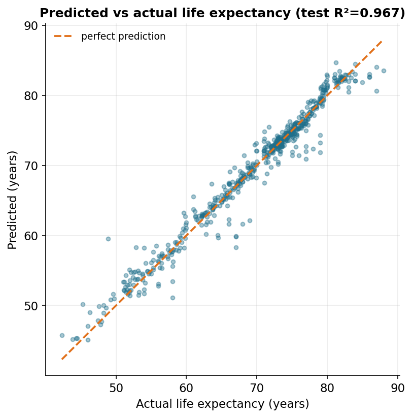
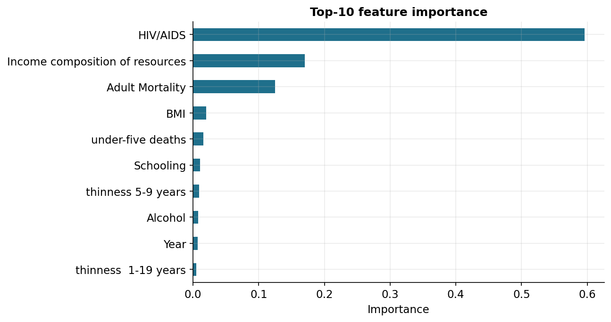
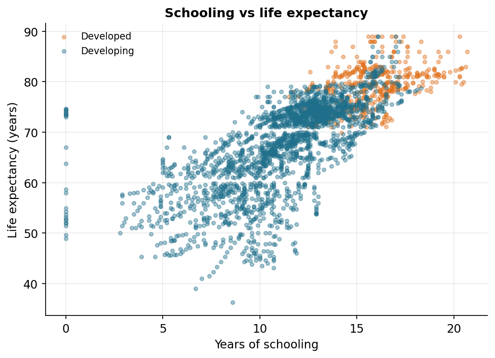

# What Predicts a Country's Life Expectancy?

### A random-forest model of national life expectancy from development indicators

**AAE 718 — Project 04 (Models), Summer 2026**

## 1. Motivation

Life expectancy at birth is one of the most compact summaries of a country's overall wellbeing — it folds together the effects of income, healthcare, disease burden, nutrition, and education into a single number of years. For anyone working in applied and development economics, a natural question is which of those underlying factors actually move the number, and by how much. This project builds a predictive model of national life expectancy from a panel of development indicators and asks two things: **how accurately can life expectancy be predicted from a country's health, economic, and social indicators, and which of those indicators carry the most weight?**

## 2. Data and methods

The data are the WHO Life Expectancy dataset (distributed on Kaggle as `kumarajarshi/life-expectancy-who`), pulled at runtime through the Kaggle API rather than stored in the repository. It covers 193 countries from 2000–2015, with about twenty indicators per country-year: the target, life expectancy at birth, plus economic variables (GDP, government health expenditure, an "income composition of resources" human-development index), disease and mortality measures (adult mortality, under-five deaths, HIV/AIDS, measles, immunization coverage for polio, diphtheria, and hepatitis B), and social and nutritional variables (years of schooling, alcohol use, BMI, child thinness).

After dropping the small number of rows with no recorded life expectancy, I encoded the Developed/Developing status as a binary flag and used every remaining indicator as a feature (2,928 country-year rows, 20 features). The data were split 80/20 into training and test sets, and missing values were imputed with **training-set** medians computed *after* the split, so that no information from the test set leaks into preprocessing. I fit a random-forest regressor (300 trees) and, as a reference point, an ordinary linear regression, and evaluated both by R² on the held-out test set.

## 3. Results

### 3.1 The model predicts life expectancy accurately

*Figure 1. Predicted vs actual life expectancy on the test set.*

The random forest achieves a **training R² of 0.995 and a test R² of 0.967**, with a mean absolute error of about **1.05 years** on data it never saw during training. Figure 1 shows the test-set predictions hugging the 45-degree line tightly across the entire range, from countries near 45 years to those near 85. The gap between training and test R² is modest, indicating the forest generalizes well rather than simply memorizing. A plain linear regression, by contrast, reaches only R² ≈ 0.82 on both train and test — respectable, but well short of the forest, which tells us the relationships are meaningfully non-linear and involve interactions a single straight-line fit cannot capture.

### 3.2 Which factors matter most

*Figure 2. Most important predictors of life expectancy.*

Figure 2 ranks the features by importance. One variable stands out: **HIV/AIDS prevalence** alone accounts for roughly 60% of the model's predictive power. This reflects the dataset's geography — the countries with the lowest life expectancies are largely those that suffered the most severe HIV/AIDS epidemics, so this single indicator separates them sharply from the rest. After it come the **income composition of resources** (a human-development index combining income, education, and health, correlation +0.72 with life expectancy), **adult mortality** (−0.70), and then **BMI**, **under-five deaths**, and **schooling**.

### 3.3 The schooling gradient

*Figure 3. Schooling vs life expectancy, colored by development status.*

Schooling illustrates the kind of socioeconomic gradient the model relies on. Figure 3 shows a strong positive relationship (correlation +0.75): each additional expected year of schooling is associated with markedly higher life expectancy, and the developed countries cluster in the upper-right while developing countries spread across the lower-left. Education here is partly a proxy for the broader bundle of development — income, public health infrastructure, and women's status — that jointly raises survival.

## 4. Discussion

**Implications.** The exercise confirms, with a transparent model, that life expectancy is highly predictable from a handful of development indicators, and that the dominant levers in this period were the HIV/AIDS burden and the broad human-development bundle (income, schooling, and health investment) rather than raw GDP, which ranked lower than one might expect. That ordering matters for policy: it points toward disease control and human-capital investment, not income growth alone, as the factors most tightly linked to longer lives.

**Limitations.** Three are worth stating plainly. First, several top predictors — adult mortality and under-five deaths — are themselves *mortality* measures, so part of their predictive power is mechanical rather than causal; a model meant to explain rather than predict would drop them. Second, this is observational panel data, so every relationship here is a correlation, not a proven cause. Third, the dataset has substantial missingness (GDP, population, and several health columns), which median imputation papers over and which could bias the fitted relationships.

**How it could be improved.** The honest next step is to refit without the tautological mortality features, to see how well the genuinely upstream socioeconomic variables predict on their own. Beyond that: add country and year fixed effects to exploit the panel structure, replace median imputation with a model-based imputer, tune the forest (or try gradient boosting) with cross-validation, and bring in indicators the dataset lacks — sanitation, clean-water access, and physician density — that development economics suggests should matter.

---

*Code and figures are in the project GitHub repository: https://github.com/Wintersatellite/Life_expectancy_analysis  Data: WHO Life Expectancy dataset via the Kaggle API.*
